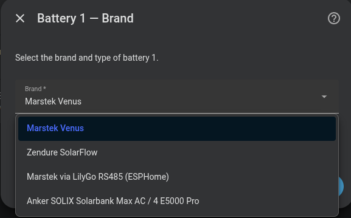
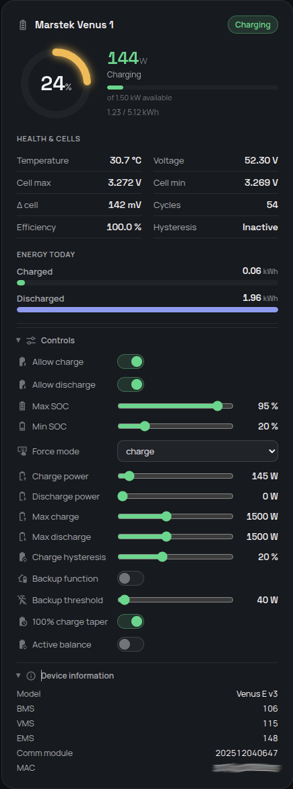

# Battery configuration

## Number of batteries

Select how many battery units you have (1–6). The integration will ask you to configure each one separately.

{ width="650"  style="display: block; margin: 0 auto;"}

---

## Battery brand

Each battery is added under a **brand** — **Marstek** (Venus, over Modbus TCP/RTU) or **Zendure** (SolarFlow 2400 AC / AC Pro / AC+, over local HTTP). 

{ width="650"  style="display: block; margin: 0 auto;"}

The brand you pick changes the connection fields below: Marstek asks for the Modbus host/port (or a serial path) and battery version; Zendure auto-detects the model and only needs the device's local IP. The rest of the integration — control loop, sensors, dashboard, predictive charging — is shared.The fields documented on this page are for **Marstek** batteries. The control and SOC/power sliders behave the same for Zendure; only the connection and a user-set capacity differ.

## Hoymiles MS-A2 (MQTT)

The MS-A2 uses the MQTT broker already configured in Home Assistant; Omnibattery never needs its host, port or credentials. In S-Miles Home, enable **MQTT Service** on firmware that supports it and point it at that HA broker, then enter the MQTT device ID (for example `MSA-280024341346`). MQTT integration must be configured in Home Assistant first.

The setup asks for the nominal usable capacity (default `2.24 kWh`; use `4.48 kWh` for a paired system). Its signed wire power is handled internally: positive Omnibattery power means charging while the device uses negative power for charging. While Omnibattery controls the unit it renews the external `mqtt_ctrl` command about every 50 seconds. On unload it sends zero power and restores `general`, so the battery is not left in external control.

See [Install and configure a Hoymiles MS-A2](hoymiles-ms-a2.md) for the physical,
S-Miles Home, MQTT and Omnibattery setup sequence.

---

## Per-battery Marstek parameters

| Parameter | Description | Default |
|---|---|---|
| **Name** | Unique identifier (e.g. "Venus 1") | — |
| **Host IP** | IP address of the Modbus TCP converter | — |
| **Modbus Port** | Modbus TCP port | `502` |
| **Serial port (Modbus RTU)** | COM port when using USB-RS485 adapter (leave empty for TCP) | — |
| **Modbus Slave ID** | Use when mapping several Marstek batteries to one IP:port using distinct slave ids | `1` |
| **Version** | Battery model | — |
| **Max charge/discharge power (W)** | Rated power of your setup | — |
| **Max SOC (%)** | Stop charging at this percentage | `100 %` |
| **Min SOC (%)** | Stop discharging at this percentage | `12 %` |
| **Charge hysteresis (%)** | Always on (minimum 2 %). After the battery reaches the top it won't charge again until SOC drops by this margin — avoids rapid cycling and absorbs SOC-reading drift | `2 %` |
| **Backup offgrid threshold (W)** | Minimum offgrid load (W) to be considered an active backup event | `50 W` |
| **Enable 100% charge voltage taper** | When target is 100%, limit charge to 200 W from 3.48 V max cell voltage and stop at 3.60 V to measure imbalance after 60 seconds | `on` |

### Battery versions

| Version | Models |
|---|---|
| `v1/v2` | Venus E v1, Venus E v2 |
| `v3` | Venus E v3 |
| `vA` | Venus A |
| `vD` | Venus D |

!!! warning "Maximum power 2500 W"
    Only use **2500 W** mode if you are certain your domestic installation can safely handle that power level.

{ width="650"  style="display: block; margin: 0 auto;"}

{ width="650"  style="display: block; margin: 0 auto;"}

---

## SOC and power limits at runtime

Max/min SOC and max charge/discharge power values can be adjusted at any time using the integration's sliders without reconfiguring. Changes are persisted and restored on every Home Assistant restart.

If you raise a battery's **Max SOC** to `100 %`, that battery uses voltage-based top protection: 200 W charge throttle from `max_cell_voltage >= 3.48 V`, then charging stops at 3.60 V and the integration waits 60 s to record the balance measurement. Charging then stays stopped (it does not re-trickle and there is no forced discharge) until the configured charge-hysteresis threshold is crossed — so the cell relaxes off the top instead of being held there. See [Cell balance monitor](../features/cell-balance-monitor.md#100-charge-voltage-taper) for the exact entry and exit conditions.

{ width="650"  style="display: block; margin: 0 auto;"}

---

## Backup offgrid threshold at runtime

The **Backup Offgrid Threshold** number entity (visible on each battery's device card, under configuration entities) lets you adjust the threshold at any time without entering the options flow. Raise it if your battery has small permanent loads on its offgrid port — such as a PoE switch, router, or IP cameras — that would otherwise keep it permanently excluded from PD control.

| Load scenario | Recommended threshold |
|---|---|
| No permanent offgrid loads | `0 W` (any load triggers exclusion) |
| Small standby loads (router + switch, ~20–40 W) | `50 W` (default) |
| Heavier permanent loads (NAS, AP, cameras, ~80–120 W) | `150 W` |

!!! tip "How it works"
    When the **Backup Function** switch is ON and the measured offgrid load is **above** the threshold, the battery is excluded from PD control and manages itself autonomously. A 5-minute cooldown applies after the load drops back below the threshold, to avoid sending commands immediately after a backup event ends.
