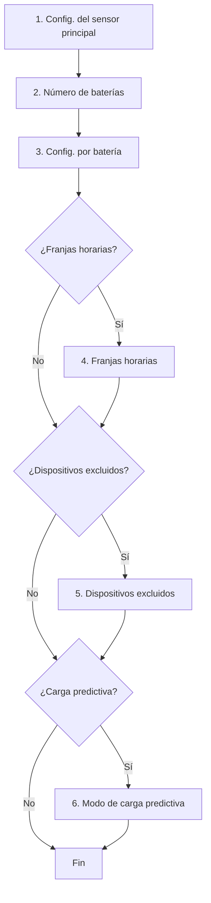

# Configuración

La configuración inicial de la integración se completa desde la interfaz de
Home Assistant mediante un asistente de varios pasos. Los controles específicos
de cada funcionalidad disponibles después de la instalación se documentan en
sus páginas correspondientes de la sección **Funcionalidades**.

## Configuración del asistente de Home Assistant

| Sección | Descripción | Obligatorio |
|------|-------------|:-----------:|
| [Sensores](main-sensor.md) | Sensor de consumo de red y sensor solar (el consumo del hogar se deriva) | ✅ |
| Baterías | Número de unidades | ✅ |
| [Baterías](batteries.md) | Configuración por batería: nombre, IP, puerto, versión, límites de potencia y SOC | ✅ |
| [Franjas horarias](time-slots.md) | Ventanas de descarga/carga con parámetros por franja | ❌ |
| [Dispositivos excluidos](excluded-devices.md) | Cargas pesadas a ignorar | ❌ |
| [Carga predictiva](predictive-charging/index.md) | Carga desde la red cuando la previsión solar es insuficiente | ❌ |

## Modificar la configuración

Una vez instalada, puedes modificar cualquier parámetro en:
**Ajustes → Dispositivos y servicios → Omnibattery → Configurar**

{ width="650" style="display: block; margin: 0 auto;"}
