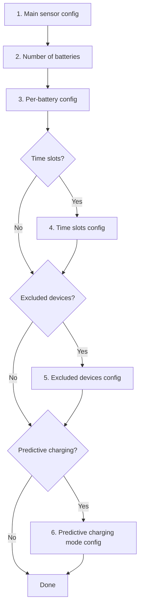
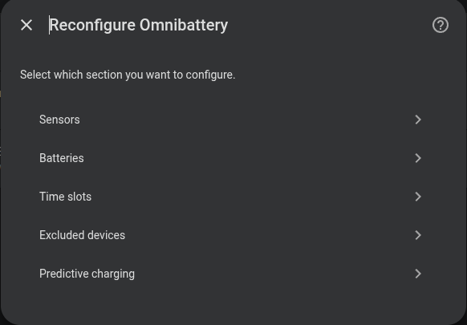

# Configuration

The initial integration setup is completed through the Home Assistant UI using a
multi-step wizard. Feature-specific controls available after setup are
documented on their respective pages in the **Features** section.

## Home Assistant wizard configuration

| Section | Description | Required |
|------|-------------|:--------:|
| [Sensors](main-sensor.md) | Grid consumption sensor and solar sensor (home consumption is derived) | ✅ |
| [Batteries](batteries/index.md) | Per-battery configuration, with connection details for each supported brand | ✅ |
| [Time slots](time-slots.md) | Discharge/charge windows with per-slot parameters | ❌ |
| [Excluded devices](excluded-devices.md) | Heavy loads to ignore | ❌ |
| [Predictive charging](predictive-charging/index.md) | Grid charging when solar forecast is insufficient | ❌ |

## Modifying the configuration

Once installed, any parameter can be changed at:
**Settings → Devices & Services → Omnibattery → Configure**

{ width="650" style="display: block; margin: 0 auto;"}
