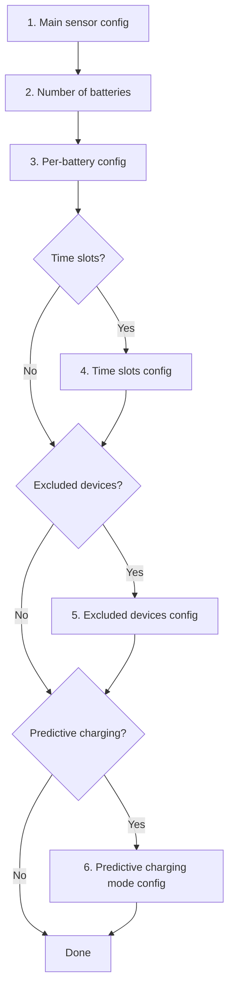

# Configuration

The integration is configured through two interfaces:

- the Home Assistant UI through a multi-step wizard
- the Omnibattery Dashboard

## Home Assistant wizard configuration

| Section | Description | Required |
|------|-------------|:--------:|
| [Sensors](main-sensor.md) | Grid consumption sensor and solar sensor (home consumption is derived) | ✅ |
| Batteries | Number of battery units | ✅ |
| [Batteries](batteries.md) | Per-battery configuration: name, IP, port, version, power limits and SOC | ✅ |
| [Time slots](time-slots.md) | Discharge/charge windows with per-slot parameters | ❌ |
| [Excluded devices](excluded-devices.md) | Heavy loads to ignore | ❌ |
| [Predictive charging](predictive-charging/index.md) | Grid charging when solar forecast is insufficient | ❌ |

## Omnibattery dashboard configuration

| Features | Description | Required |
|------|-------------|:--------:|
| [Weekly full charge](advanced.md) | Charge batteries to 100% once a week to balance the cells | ❌ |
| [Solar charge delay](advanced.md) | Avoid to charge the batteries early if expected solar production will suffice | ❌ |
| [Temperature charge limit](advanced.md) | Linear derate charge/discharge power based on battery temperature | ❌ |
| [Capacity protection](advanced.md) | Reserves a portion of battery capacity for demand spikes (peak shaving) | ❌ |
| [Hourly net balance](advanced.md) | Sets the hourly net import/export energy to a specific target (default 0 Wh) | ❌ |
| [System power limits](batteries.md#system-power-limits-all-batteries-combined) | Caps combined charge/discharge power across all active batteries | ❌ |
| [PD controller (advanced)](advanced.md) | Finetune the PD controller to keep the grid flow to the configured target | ❌ |

## Modifying the configuration

Once installed, any parameter can be changed at:
**Settings → Devices & Services → Omnibattery → Configure**

{ width="650" style="display: block; margin: 0 auto;"}
